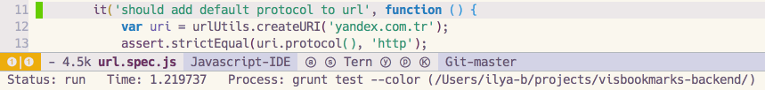

# Emacs-BPR (Background Process Runner)
This package provides logic for async process execution.

`bpr` can:
- spawn processes asynchronously in background (you are free to do other things, while process is being executed)
- show progress messages in echo area
- open window with process's output buffer in case of errors

`bpr` is best suitable for running tests or builds for your projects, but you can run any processes with it. 

# Example


Given this configuration:
```elisp
(require 'bpr)

;; define function for running desired process
(defun run-tests ()
  "Spawns 'grunt test' process"
  (interactive)
  (let* ((bpr-scroll-direction -1)
         (bpr-close-after-success t))
    (bpr-spawn "grunt test --color")))

;; set key-binding
(define-key global-map "\C-ct" 'run-tests)
```
You get this behavior:


What's happening:
- User enters predefined key-binding, which invokes function `run-tests`.
- `bpr-spawn` starts async process `grunt test --color` and writes progress messages in echo area.
- If process ends successfully - success message is being shown.
- If process ends with error - error message is being shown and window with output buffer is being opened.

# Installation
### MELPA:
Use `M-x package-install bpr` and write `(require 'bpr)` in your conifg.

### Manually
```elisp
;; If you have cloned this repo into `~/some-path/emacs-bpr/`
(add-to-list 'load-path "~/some-path/emacs-bpr/")
(require 'bpr)
```

# Configuration
You can find all configuration options in the source code.

If you want to set options globally for all processes:
```elisp
(require 'bpr)
(setq bpr-close-after-success t) ;; close error window after process ended successfully (if it's not already closed)
(setq bpr-process-mode #'comint-mode) ;; use comint-mode for processes output buffers instead of shell-mode
```

If you want to set options to particular process, set them dynamically right before `bpr-spawn`:
```elisp
(let* ((bpr-erase-process-buffer nil) ;; don't erase process output buffer before starting this process again.
       (bpr-show-progress nil)) ;; don't show progress messages (only success/error messages will be displayed)
    (bpr-spawn "ping -c 4 www.wikipedia.org"))
```

Default directory for processes is `default-directory` of current buffer, but with `projectile` installed, `bpr` would use `projectile-project-root` function.

Default major mode for process's output buffer is `shell-mode`. Note, that this buffer is only showed in case of error, but you can manually open it at any time. Template for buffers names: `*process-name (process-directory)*`

### Examples for different use cases
##### Running tests
```elisp
(defun my-test-runner ()
  "Spawns test process"
  (interactive)
  (let* ((bpr-scroll-direction -1) ;; scroll to the top of the output window (wich is being shown in case of error)
         (bpr-close-after-success t)) ;; close error window after process ended successfully (if it's not already closed)
    (bpr-spawn "rake tests")))
```
##### Running builds
```elisp
(defun my-build-runner ()
  "Spawns build process"
  (interactive)
  (let* ((bpr-process-directory "~/chromium/") ;; spawn process in this directory (instead of default-directory or projectile-project-root)
         (bpr-poll-timout 60.0)) ;; show progress messages once in 60 seconds
    (bpr-spawn "make long-build")))
```

